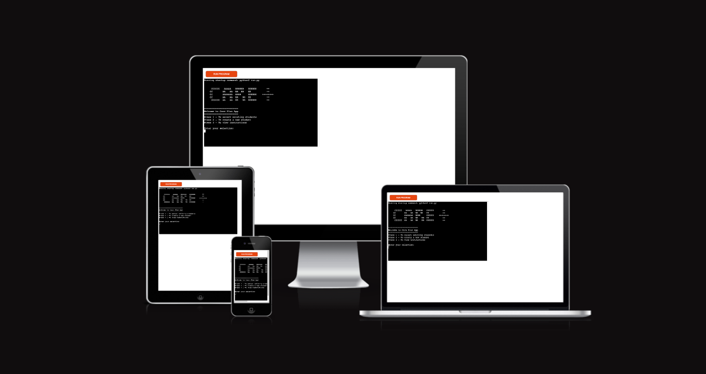
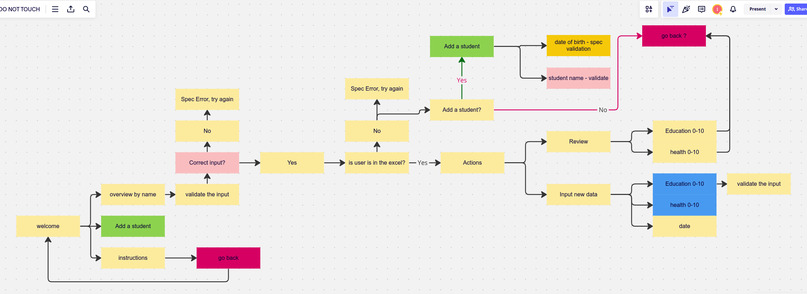
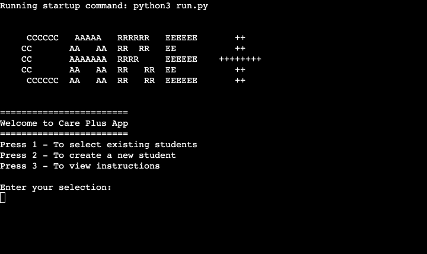
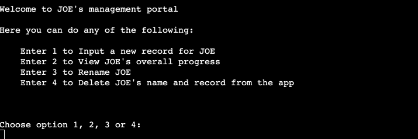
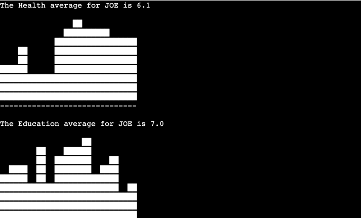
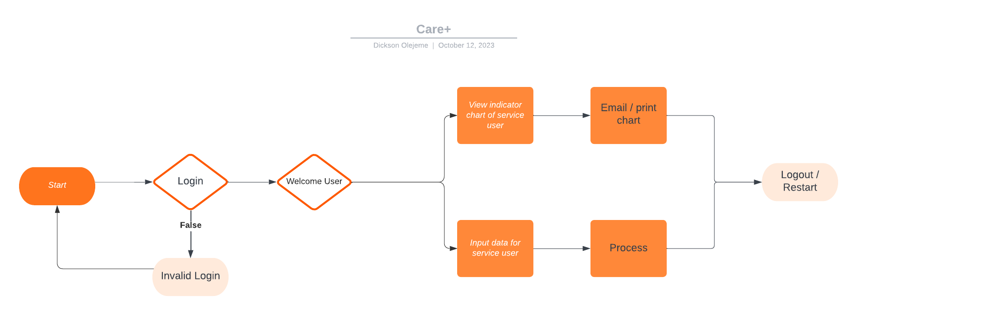

# 

## Welcome,
Care Plus App is a Python-based application designed to manage student data and track their progress in health and education. The app uses Google Sheets for data storage and visualization.
 

The link to the deployed site can be found [Here](https://care-plus-e6b7c675e391.herokuapp.com/)

## User Stories

### First-Time Visitor Goals: 
As a first-time visitor, the goals are:

- Understand the Purpose:

    Gain an understanding of the app's purpose and functionality.

- Navigate the Interface:

    Easily navigate through the menu options.

## Returning Visitor Goals:
As a returning visitor, the goals are:

- Efficient Data Management:

    Manage existing student records efficiently.
    Create and track progress for new students.

- Explore Features:

    Explore the various features, including viewing instructions, creating students, and viewing existing students.

## Logic Flowchart 
# 

## Features 
# 

### Main Menu:
The app utilizes student names as usernames, ensuring a personalized experience.

- **Select Options:**
  - Press `1` to view existing students.
  - Press `2` to create a new student.
  - Press `3` to view instructions.

- **View Existing Students:**
  - After selecting option `1`, you will see a list of existing students.
  - Enter the name of the student you want to view.
  - You have the option to Input, View, Rename, and Delete Student records.
  # 
  - Indicators:
There are currently two indicators (Health and Education) that are used to store and measure student progress.

- **Create a New Student:**
  - After selecting option `2`, enter the name of the new student.
  - Follow the prompts to input health and education progress indicators.

- **View Instructions:**
  - After selecting option `3`, instructions will be displayed on how to use the application effectively.

- **Progress Entry:**
  - When entering progress indicators, input values between 0 and 10.
  - For health and education, the app will visualize the progress with bar charts.

- **Viewing Student Summary:**
  - After entering progress indicators, choose to view the student's overall progress.
  - The app will display the average health and education scores, along with visual representations.
  - Progress Report: View comprehensive summaries of student progress, including averages and visualizations.

- **Restart or Exit:**
  - After completing any operation, press `Enter` to restart the program.
  - Type 'exit' to terminate the application.

## Testing
Rigorous manual testing was performed to ensure the app's functionality, including user inputs, menu navigation, and data entry.

Computer - Big Screens (1440 x 697)

Laptop - Medium Screens (768 * 697)

Mobile Phone - Small Screens (375 x 697)

### Manual Testing: 
| Feature | Action | Expected Result | Tested | Passed | Comments |
| --- | --- | --- | --- | --- | --- |
|     |     |     |     |     |     |
| *Front Page* |  |  |  |  |  |
|Focus Input|Key event|Cursor in input field|Yes|Yes|On page load, the cursor is seen in the input field   |
|Start Button|Click|Attempt login|Yes|Yes|     |
|Login Validation|Attempt login|Invalid Login|Yes|Yes|At least 2 and not more than 15 characters when used would activate it|
|LinkedIn icon|Click|Opens a new LinkedIn|Yes|Yes||
|*Subjects*|     |     |     |     |     |
|Government|click|Loads Government questions|Yes|Yes|     |
|Mathematics|click|Loads Mathematics questions|Yes|Yes|     |
|English|click|Loads English questions|Yes|Yes|     |
|Timer|Count down|Starts counting|Yes|Yes|Starts counting onload of new subject questions|
|Time Up|Alert message|Ends practice session|Yes|Yes|An alert pops up as soon as the time counts down to 0|
|*Buttons*|     |     |     |     |     |
|Next|Click|Loads next question|Yes|Yes|At the last question|
|Quit|Click|Attempts to end the practice session|Yes|Yes|A question is asked, so that the user can confirm|
|Print|Click|Print options opens|Yes|Yes||
|Exit|Click|The application refreshes|Yes|Yes|The front page is reloaded|
|     |     |     |     |     |     |

## Bugs:
| Issue|Solution |
|-|-|
| The timer could be paused by clicking 'Quit' button.|I introduced a 'div' that displayed above the question, allowing the user to confirm their choice while the questions remain hidden |
| The timer kept running even when a session had ended|I used the 'clearInterval' function to stop the timer |
| The choice selection for an answer, retained the red color when the user goes to the next question|I set 'const' color for the options|
| In Mozilla browser, the quit button was immediately taking users to result page, without alerting them to confirm their choice|I removed the alert function and instead added a confirmation button on the 'hide-screen' div |
|Print button on result page not working for Bing mobile browser| None yet|

### Browser Testing: 
The final project was tested on four different browsers, namely:
-Microsoft Internet Explorer
-Google Chrome
-Brave
-Mozilla Firefox
However, the application did not work on Mobile devices and the display was unresponsive.

### CI Python Linter:
The CI Python Linter https://pep8ci.herokuapp.com/ was used to test for errors in the code. No errors were found except for warning concerning white spaces or characters being longer than the 79 characters that was originally deisgned for the application

## Lucid:
Lucid was used to draw mock-ups for the initial app design to guide the development of this project.

## Technologies used:
- Python is the main technolgy used in this application
- Luci was used to create workflows for guidance in builfing the application
- VScode was used to write and edit the codes and host the site on my local computer
- Git was used for the version control of the application
- Heroku was used to host the deployed application
- ChatGPT was often consulted regarding the usage and construction of codes
- Google Chrome's "Screenshot & Screen Recorder" plugin was used to create the site logo
- Code Institute Python Linter was used to check code for any issues

## Deployment

The template for this app was generated from Code-Institute-Org/p3-template. The repository was cloned on a local VSCode machine and then stored/managed on Github. 

The Heroku gi URl is https://git.heroku.com/care-plus.git

The app was then deployed on Heroku via Github:

1. Log in to Heroku or create a new account
2. On the main page click "New" and select "Create new app"
3. Choose your unique app name and select your region
4. Click "Create app"
5. On the next page find "settings" and locate "Config Vars"
6. Click "Reveal Config Vars" and add "PORT" key and value "8000", click "Add"
7. Scroll down, locate "Buildpack" and click "Add", select "Python"
8. Repeat step 7. only this time add "Node.js", make sure "Python" is first
9. Scroll to the top and select "Deploy" tab
10. Select GitHub as deployment method and search for your repository and link them together
11. Scroll down and select either "Enable Automatic Deploys" or "Manual Deploy"
Deployed site -> [Here](https://care-plus-e6b7c675e391.herokuapp.com/)

### Local Deployment:
To clone this project, you can do so using VsCode or any code editor that has an integrated development Environment (IDE), using this command: 

     git clone https://github.com/dcsndevs/care-plus.git 

## Dependencies

- [gspread](https://gspread.readthedocs.io/en/latest/)
- [oauth2client](https://oauth2client.readthedocs.io/en/latest/)

## Usage

Follow the on-screen prompts to navigate through the application. Input valid data as guided by the application.

## Credits

### Code Reference:
W3schools was instrumental to the success of this project. It was often used to learn quick features or to compare and see where errors are.

### CarePlus Logic: 
The logic behid the application is a real life application called [©WellTree] (https://www.welltree.info/)
Welltree inputs are manually done on an excel worksheet, but this application was built with the intention of automating the inputs and view student progress over time.

### Acknowledgments:
I like to thank [Juliia Konn](https://github.com/IuliiaKonovalova/), my mentor at Code Institute. She exemplifies her mentorship with a knack for high-quality projects. Her desire for quality has always challenged me to do better in my work. I remain grateful to her.

I also like to thank my loving wife for her continuous support. She's a source of strength as always.